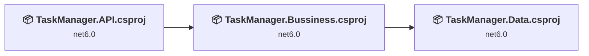
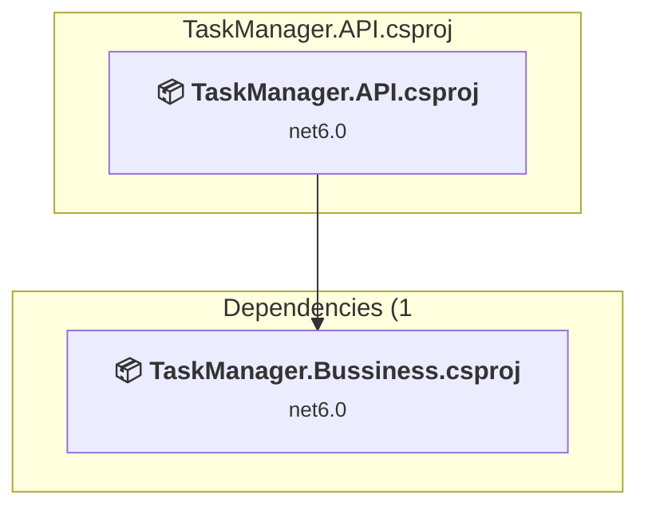
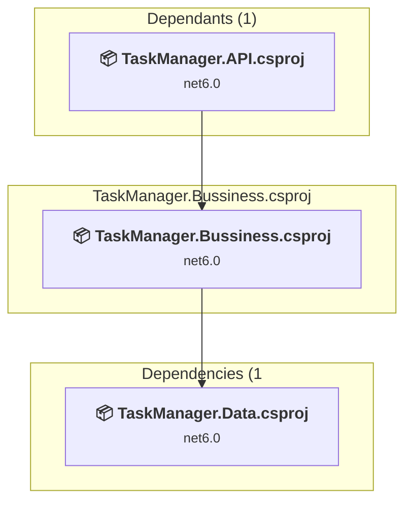
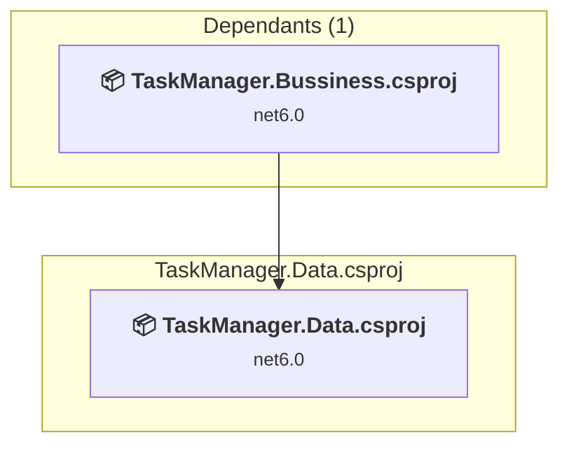

# Projects and dependencies analysis

This document provides a comprehensive overview of the projects and their dependencies in the context of upgrading to .NETCoreApp,Version=v10.0.

## Table of Contents

- [Executive Summary](#executive-Summary)
  - [Highlevel Metrics](#highlevel-metrics)
  - [Projects Compatibility](#projects-compatibility)
  - [Package Compatibility](#package-compatibility)
  - [API Compatibility](#api-compatibility)
  - [Binding Redirect Configuration](#binding-redirect-configuration)
- [Aggregate NuGet packages details](#aggregate-nuget-packages-details)
- [Top API Migration Challenges](#top-api-migration-challenges)
  - [Technologies and Features](#technologies-and-features)
  - [Most Frequent API Issues](#most-frequent-api-issues)
- [Projects Relationship Graph](#projects-relationship-graph)
- [Project Details](#project-details)

  - [TaskManager.API\TaskManager.API.csproj](#taskmanagerapitaskmanagerapicsproj)
  - [TaskManager.Bussiness\TaskManager.Bussiness.csproj](#taskmanagerbussinesstaskmanagerbussinesscsproj)
  - [TaskManager.Data\TaskManager.Data.csproj](#taskmanagerdatataskmanagerdatacsproj)

## Executive Summary

### Highlevel Metrics

| Metric | Count | Status |
| :--- | :---: | :--- |
| Total Projects | 3 | All require upgrade |
| Total NuGet Packages | 169 | 12 need upgrade |
| Total Code Files | 299 |  |
| Total Code Files with Incidents | 24 |  |
| Total Lines of Code | 21887 |  |
| Total Number of Issues | 68 |  |
| Estimated LOC to modify | 52+ | at least 0.2% of codebase |

### Projects Compatibility

| Project | Target Framework | Difficulty | Package Issues | API Issues | Binding Issues | Est. LOC Impact | Description |
| :--- | :---: | :---: | :---: | :---: | :---: | :---: | :--- |
| [TaskManager.API\TaskManager.API.csproj](#taskmanagerapitaskmanagerapicsproj) | net6.0 | 🟢 Low | 8 | 42 | 0 | 42+ | AspNetCore, Sdk Style = True |
| [TaskManager.Bussiness\TaskManager.Bussiness.csproj](#taskmanagerbussinesstaskmanagerbussinesscsproj) | net6.0 | 🟢 Low | 0 | 10 | 0 | 10+ | ClassLibrary, Sdk Style = True |
| [TaskManager.Data\TaskManager.Data.csproj](#taskmanagerdatataskmanagerdatacsproj) | net6.0 | 🟢 Low | 5 | 0 | 0 |  | ClassLibrary, Sdk Style = True |

### Package Compatibility

| Status | Count | Percentage |
| :--- | :---: | :---: |
| ✅ Compatible | 157 | 92.9% |
| ⚠️ Incompatible | 3 | 1.8% |
| 🔄 Upgrade Recommended | 9 | 5.3% |
| ***Total NuGet Packages*** | ***169*** | ***100%*** |

### API Compatibility

| Category | Count | Impact |
| :--- | :---: | :--- |
| 🔴 Binary Incompatible | 19 | High - Require code changes |
| 🟡 Source Incompatible | 33 | Medium - Needs re-compilation and potential conflicting API error fixing |
| 🔵 Behavioral change | 0 | Low - Behavioral changes that may require testing at runtime |
| ✅ Compatible | 27587 |  |
| ***Total APIs Analyzed*** | ***27639*** |  |

## Aggregate NuGet packages details

| Package | Current Version | Suggested Version | Projects | Description |
| :--- | :---: | :---: | :--- | :--- |
| AspNetCore.HealthChecks.Redis | 6.0.4 |  | [TaskManager.API.csproj](#taskmanagerapitaskmanagerapicsproj) | ✅Compatible |
| AspNetCore.HealthChecks.UI | 6.0.5 |  | [TaskManager.API.csproj](#taskmanagerapitaskmanagerapicsproj) | ✅Compatible |
| AspNetCore.HealthChecks.UI.Client | 6.0.5 |  | [TaskManager.API.csproj](#taskmanagerapitaskmanagerapicsproj) | ✅Compatible |
| AspNetCore.HealthChecks.UI.Core | 6.0.5 |  | [TaskManager.API.csproj](#taskmanagerapitaskmanagerapicsproj) | ✅Compatible |
| AspNetCore.HealthChecks.UI.InMemory.Storage | 6.0.5 |  | [TaskManager.API.csproj](#taskmanagerapitaskmanagerapicsproj) | ✅Compatible |
| AutoMapper | 12.0.1 | 16.2.0 | [TaskManager.API.csproj](#taskmanagerapitaskmanagerapicsproj) | NuGet package contains security vulnerability |
| AutoMapper.Extensions.Microsoft.DependencyInjection | 12.0.1 |  | [TaskManager.API.csproj](#taskmanagerapitaskmanagerapicsproj) | ⚠️NuGet package is deprecated |
| FluentValidation | 11.11.0 |  | [TaskManager.API.csproj](#taskmanagerapitaskmanagerapicsproj) | ✅Compatible |
| FluentValidation.AspNetCore | 11.3.1 |  | [TaskManager.API.csproj](#taskmanagerapitaskmanagerapicsproj) | ⚠️NuGet package is deprecated |
| FluentValidation.DependencyInjectionExtensions | 11.11.0 |  | [TaskManager.API.csproj](#taskmanagerapitaskmanagerapicsproj) | ✅Compatible |
| Fractions | 4.0.1 |  | [TaskManager.API.csproj](#taskmanagerapitaskmanagerapicsproj) | ✅Compatible |
| Humanizer.Core | 2.8.26 |  | [TaskManager.API.csproj](#taskmanagerapitaskmanagerapicsproj) [TaskManager.Data.csproj](#taskmanagerdatataskmanagerdatacsproj) | ✅Compatible |
| IdentityModel | 4.1.0 |  | [TaskManager.API.csproj](#taskmanagerapitaskmanagerapicsproj) | ✅Compatible |
| IdentityModel.OidcClient | 3.1.2 |  | [TaskManager.API.csproj](#taskmanagerapitaskmanagerapicsproj) | ✅Compatible |
| KubernetesClient | 4.0.26 |  | [TaskManager.API.csproj](#taskmanagerapitaskmanagerapicsproj) | ✅Compatible |
| Microsoft.AspNetCore.Authentication | 2.3.9 |  | [TaskManager.API.csproj](#taskmanagerapitaskmanagerapicsproj) [TaskManager.Bussiness.csproj](#taskmanagerbussinesstaskmanagerbussinesscsproj) | ✅Compatible |
| Microsoft.AspNetCore.Authentication.Abstractions | 2.3.0 |  | [TaskManager.API.csproj](#taskmanagerapitaskmanagerapicsproj) [TaskManager.Bussiness.csproj](#taskmanagerbussinesstaskmanagerbussinesscsproj) | ✅Compatible |
| Microsoft.AspNetCore.Authentication.Cookies | 2.3.10 |  | [TaskManager.API.csproj](#taskmanagerapitaskmanagerapicsproj) [TaskManager.Bussiness.csproj](#taskmanagerbussinesstaskmanagerbussinesscsproj) | ✅Compatible |
| Microsoft.AspNetCore.Authentication.Core | 2.3.0 |  | [TaskManager.API.csproj](#taskmanagerapitaskmanagerapicsproj) [TaskManager.Bussiness.csproj](#taskmanagerbussinesstaskmanagerbussinesscsproj) | ✅Compatible |
| Microsoft.AspNetCore.Authentication.JwtBearer | 6.0.36 | 10.0.11 | [TaskManager.API.csproj](#taskmanagerapitaskmanagerapicsproj) | NuGet package upgrade is recommended |
| Microsoft.AspNetCore.Cryptography.Internal | 6.0.36 |  | [TaskManager.API.csproj](#taskmanagerapitaskmanagerapicsproj) [TaskManager.Bussiness.csproj](#taskmanagerbussinesstaskmanagerbussinesscsproj) [TaskManager.Data.csproj](#taskmanagerdatataskmanagerdatacsproj) | ✅Compatible |
| Microsoft.AspNetCore.Cryptography.KeyDerivation | 6.0.36 |  | [TaskManager.API.csproj](#taskmanagerapitaskmanagerapicsproj) [TaskManager.Bussiness.csproj](#taskmanagerbussinesstaskmanagerbussinesscsproj) [TaskManager.Data.csproj](#taskmanagerdatataskmanagerdatacsproj) | ✅Compatible |
| Microsoft.AspNetCore.DataProtection | 2.3.0 |  | [TaskManager.API.csproj](#taskmanagerapitaskmanagerapicsproj) [TaskManager.Bussiness.csproj](#taskmanagerbussinesstaskmanagerbussinesscsproj) | ✅Compatible |
| Microsoft.AspNetCore.DataProtection.Abstractions | 2.3.0 |  | [TaskManager.API.csproj](#taskmanagerapitaskmanagerapicsproj) [TaskManager.Bussiness.csproj](#taskmanagerbussinesstaskmanagerbussinesscsproj) | ✅Compatible |
| Microsoft.AspNetCore.Hosting.Abstractions | 2.3.10 |  | [TaskManager.API.csproj](#taskmanagerapitaskmanagerapicsproj) [TaskManager.Bussiness.csproj](#taskmanagerbussinesstaskmanagerbussinesscsproj) | ✅Compatible |
| Microsoft.AspNetCore.Hosting.Server.Abstractions | 2.3.9 |  | [TaskManager.API.csproj](#taskmanagerapitaskmanagerapicsproj) [TaskManager.Bussiness.csproj](#taskmanagerbussinesstaskmanagerbussinesscsproj) | ✅Compatible |
| Microsoft.AspNetCore.Http | 2.3.0 |  | [TaskManager.API.csproj](#taskmanagerapitaskmanagerapicsproj) [TaskManager.Bussiness.csproj](#taskmanagerbussinesstaskmanagerbussinesscsproj) | ✅Compatible |
| Microsoft.AspNetCore.Http.Abstractions | 2.3.9 |  | [TaskManager.API.csproj](#taskmanagerapitaskmanagerapicsproj) [TaskManager.Bussiness.csproj](#taskmanagerbussinesstaskmanagerbussinesscsproj) | ✅Compatible |
| Microsoft.AspNetCore.Http.Extensions | 2.3.0 |  | [TaskManager.API.csproj](#taskmanagerapitaskmanagerapicsproj) [TaskManager.Bussiness.csproj](#taskmanagerbussinesstaskmanagerbussinesscsproj) | ✅Compatible |
| Microsoft.AspNetCore.Http.Features | 2.3.0 |  | [TaskManager.API.csproj](#taskmanagerapitaskmanagerapicsproj) [TaskManager.Bussiness.csproj](#taskmanagerbussinesstaskmanagerbussinesscsproj) | ✅Compatible |
| Microsoft.AspNetCore.Identity | 2.3.11 |  | [TaskManager.API.csproj](#taskmanagerapitaskmanagerapicsproj) [TaskManager.Bussiness.csproj](#taskmanagerbussinesstaskmanagerbussinesscsproj) | ✅Compatible |
| Microsoft.AspNetCore.Identity.EntityFrameworkCore | 6.0.36 | 10.0.11 | [TaskManager.API.csproj](#taskmanagerapitaskmanagerapicsproj) [TaskManager.Bussiness.csproj](#taskmanagerbussinesstaskmanagerbussinesscsproj) [TaskManager.Data.csproj](#taskmanagerdatataskmanagerdatacsproj) | NuGet package upgrade is recommended |
| Microsoft.AspNetCore.WebUtilities | 2.3.0 |  | [TaskManager.API.csproj](#taskmanagerapitaskmanagerapicsproj) [TaskManager.Bussiness.csproj](#taskmanagerbussinesstaskmanagerbussinesscsproj) | ✅Compatible |
| Microsoft.CSharp | 4.5.0 |  | [TaskManager.Bussiness.csproj](#taskmanagerbussinesstaskmanagerbussinesscsproj) [TaskManager.Data.csproj](#taskmanagerdatataskmanagerdatacsproj) | ✅Compatible |
| Microsoft.CSharp | 4.7.0 |  | [TaskManager.API.csproj](#taskmanagerapitaskmanagerapicsproj) | ✅Compatible |
| Microsoft.Data.SqlClient | 2.1.7 |  | [TaskManager.API.csproj](#taskmanagerapitaskmanagerapicsproj) [TaskManager.Bussiness.csproj](#taskmanagerbussinesstaskmanagerbussinesscsproj) [TaskManager.Data.csproj](#taskmanagerdatataskmanagerdatacsproj) | ✅Compatible |
| Microsoft.Data.SqlClient.SNI.runtime | 2.1.1 |  | [TaskManager.API.csproj](#taskmanagerapitaskmanagerapicsproj) [TaskManager.Bussiness.csproj](#taskmanagerbussinesstaskmanagerbussinesscsproj) [TaskManager.Data.csproj](#taskmanagerdatataskmanagerdatacsproj) | ✅Compatible |
| Microsoft.Data.Sqlite.Core | 6.0.7 |  | [TaskManager.API.csproj](#taskmanagerapitaskmanagerapicsproj) | ✅Compatible |
| Microsoft.EntityFrameworkCore | 6.0.36 | 10.0.11 | [TaskManager.API.csproj](#taskmanagerapitaskmanagerapicsproj) [TaskManager.Bussiness.csproj](#taskmanagerbussinesstaskmanagerbussinesscsproj) [TaskManager.Data.csproj](#taskmanagerdatataskmanagerdatacsproj) | NuGet package upgrade is recommended |
| Microsoft.EntityFrameworkCore.Abstractions | 6.0.36 |  | [TaskManager.API.csproj](#taskmanagerapitaskmanagerapicsproj) [TaskManager.Bussiness.csproj](#taskmanagerbussinesstaskmanagerbussinesscsproj) [TaskManager.Data.csproj](#taskmanagerdatataskmanagerdatacsproj) | ✅Compatible |
| Microsoft.EntityFrameworkCore.Analyzers | 6.0.36 |  | [TaskManager.API.csproj](#taskmanagerapitaskmanagerapicsproj) [TaskManager.Bussiness.csproj](#taskmanagerbussinesstaskmanagerbussinesscsproj) [TaskManager.Data.csproj](#taskmanagerdatataskmanagerdatacsproj) | ✅Compatible |
| Microsoft.EntityFrameworkCore.Design | 6.0.36 | 10.0.11 | [TaskManager.API.csproj](#taskmanagerapitaskmanagerapicsproj) [TaskManager.Data.csproj](#taskmanagerdatataskmanagerdatacsproj) | NuGet package upgrade is recommended |
| Microsoft.EntityFrameworkCore.InMemory | 6.0.7 |  | [TaskManager.API.csproj](#taskmanagerapitaskmanagerapicsproj) | ✅Compatible |
| Microsoft.EntityFrameworkCore.Relational | 6.0.36 |  | [TaskManager.API.csproj](#taskmanagerapitaskmanagerapicsproj) [TaskManager.Bussiness.csproj](#taskmanagerbussinesstaskmanagerbussinesscsproj) [TaskManager.Data.csproj](#taskmanagerdatataskmanagerdatacsproj) | ✅Compatible |
| Microsoft.EntityFrameworkCore.Relational.Design | 2.0.0-preview1-final |  | [TaskManager.API.csproj](#taskmanagerapitaskmanagerapicsproj) | ✅Compatible |
| Microsoft.EntityFrameworkCore.Sqlite | 6.0.7 |  | [TaskManager.API.csproj](#taskmanagerapitaskmanagerapicsproj) | ✅Compatible |
| Microsoft.EntityFrameworkCore.Sqlite.Core | 6.0.7 |  | [TaskManager.API.csproj](#taskmanagerapitaskmanagerapicsproj) | ✅Compatible |
| Microsoft.EntityFrameworkCore.Sqlite.Design | 2.0.0-preview1-final |  | [TaskManager.API.csproj](#taskmanagerapitaskmanagerapicsproj) | ✅Compatible |
| Microsoft.EntityFrameworkCore.SqlServer | 6.0.36 | 10.0.11 | [TaskManager.API.csproj](#taskmanagerapitaskmanagerapicsproj) [TaskManager.Bussiness.csproj](#taskmanagerbussinesstaskmanagerbussinesscsproj) [TaskManager.Data.csproj](#taskmanagerdatataskmanagerdatacsproj) | NuGet package upgrade is recommended |
| Microsoft.EntityFrameworkCore.Tools | 6.0.36 | 10.0.11 | [TaskManager.Data.csproj](#taskmanagerdatataskmanagerdatacsproj) | NuGet package upgrade is recommended |
| Microsoft.Extensions.ApiDescription.Server | 6.0.5 |  | [TaskManager.API.csproj](#taskmanagerapitaskmanagerapicsproj) | ✅Compatible |
| Microsoft.Extensions.Caching.Abstractions | 6.0.1 |  | [TaskManager.API.csproj](#taskmanagerapitaskmanagerapicsproj) [TaskManager.Bussiness.csproj](#taskmanagerbussinesstaskmanagerbussinesscsproj) [TaskManager.Data.csproj](#taskmanagerdatataskmanagerdatacsproj) | ✅Compatible |
| Microsoft.Extensions.Caching.Memory | 6.0.3 |  | [TaskManager.API.csproj](#taskmanagerapitaskmanagerapicsproj) [TaskManager.Bussiness.csproj](#taskmanagerbussinesstaskmanagerbussinesscsproj) [TaskManager.Data.csproj](#taskmanagerdatataskmanagerdatacsproj) | ✅Compatible |
| Microsoft.Extensions.Caching.StackExchangeRedis | 6.0.36 | 10.0.11 | [TaskManager.API.csproj](#taskmanagerapitaskmanagerapicsproj) | NuGet package upgrade is recommended |
| Microsoft.Extensions.Configuration | 2.0.0 |  | [TaskManager.API.csproj](#taskmanagerapitaskmanagerapicsproj) | ✅Compatible |
| Microsoft.Extensions.Configuration.Abstractions | 6.0.1 |  | [TaskManager.Data.csproj](#taskmanagerdatataskmanagerdatacsproj) | ✅Compatible |
| Microsoft.Extensions.Configuration.Abstractions | 8.0.0 |  | [TaskManager.API.csproj](#taskmanagerapitaskmanagerapicsproj) [TaskManager.Bussiness.csproj](#taskmanagerbussinesstaskmanagerbussinesscsproj) | ✅Compatible |
| Microsoft.Extensions.Configuration.Binder | 2.0.0 |  | [TaskManager.API.csproj](#taskmanagerapitaskmanagerapicsproj) | ✅Compatible |
| Microsoft.Extensions.DependencyInjection | 6.0.2 |  | [TaskManager.API.csproj](#taskmanagerapitaskmanagerapicsproj) [TaskManager.Bussiness.csproj](#taskmanagerbussinesstaskmanagerbussinesscsproj) [TaskManager.Data.csproj](#taskmanagerdatataskmanagerdatacsproj) | ✅Compatible |
| Microsoft.Extensions.DependencyInjection.Abstractions | 6.0.0 |  | [TaskManager.Data.csproj](#taskmanagerdatataskmanagerdatacsproj) | ✅Compatible |
| Microsoft.Extensions.DependencyInjection.Abstractions | 8.0.2 |  | [TaskManager.API.csproj](#taskmanagerapitaskmanagerapicsproj) [TaskManager.Bussiness.csproj](#taskmanagerbussinesstaskmanagerbussinesscsproj) | ✅Compatible |
| Microsoft.Extensions.DependencyModel | 6.0.0 |  | [TaskManager.API.csproj](#taskmanagerapitaskmanagerapicsproj) | ✅Compatible |
| Microsoft.Extensions.Diagnostics.Abstractions | 8.0.1 |  | [TaskManager.API.csproj](#taskmanagerapitaskmanagerapicsproj) [TaskManager.Bussiness.csproj](#taskmanagerbussinesstaskmanagerbussinesscsproj) | ✅Compatible |
| Microsoft.Extensions.Diagnostics.HealthChecks | 6.0.36 |  | [TaskManager.API.csproj](#taskmanagerapitaskmanagerapicsproj) | ✅Compatible |
| Microsoft.Extensions.Diagnostics.HealthChecks.Abstractions | 6.0.36 |  | [TaskManager.API.csproj](#taskmanagerapitaskmanagerapicsproj) | ✅Compatible |
| Microsoft.Extensions.Diagnostics.HealthChecks.EntityFrameworkCore | 6.0.36 | 10.0.11 | [TaskManager.API.csproj](#taskmanagerapitaskmanagerapicsproj) | NuGet package upgrade is recommended |
| Microsoft.Extensions.FileProviders.Abstractions | 8.0.0 |  | [TaskManager.API.csproj](#taskmanagerapitaskmanagerapicsproj) [TaskManager.Bussiness.csproj](#taskmanagerbussinesstaskmanagerbussinesscsproj) | ✅Compatible |
| Microsoft.Extensions.Hosting.Abstractions | 8.0.1 |  | [TaskManager.API.csproj](#taskmanagerapitaskmanagerapicsproj) [TaskManager.Bussiness.csproj](#taskmanagerbussinesstaskmanagerbussinesscsproj) | ✅Compatible |
| Microsoft.Extensions.Http | 6.0.0 |  | [TaskManager.API.csproj](#taskmanagerapitaskmanagerapicsproj) | ✅Compatible |
| Microsoft.Extensions.Identity.Core | 6.0.36 |  | [TaskManager.API.csproj](#taskmanagerapitaskmanagerapicsproj) [TaskManager.Bussiness.csproj](#taskmanagerbussinesstaskmanagerbussinesscsproj) [TaskManager.Data.csproj](#taskmanagerdatataskmanagerdatacsproj) | ✅Compatible |
| Microsoft.Extensions.Identity.Stores | 6.0.36 |  | [TaskManager.API.csproj](#taskmanagerapitaskmanagerapicsproj) [TaskManager.Bussiness.csproj](#taskmanagerbussinesstaskmanagerbussinesscsproj) [TaskManager.Data.csproj](#taskmanagerdatataskmanagerdatacsproj) | ✅Compatible |
| Microsoft.Extensions.Logging | 6.0.1 |  | [TaskManager.API.csproj](#taskmanagerapitaskmanagerapicsproj) [TaskManager.Bussiness.csproj](#taskmanagerbussinesstaskmanagerbussinesscsproj) [TaskManager.Data.csproj](#taskmanagerdatataskmanagerdatacsproj) | ✅Compatible |
| Microsoft.Extensions.Logging.Abstractions | 6.0.4 |  | [TaskManager.Data.csproj](#taskmanagerdatataskmanagerdatacsproj) | ✅Compatible |
| Microsoft.Extensions.Logging.Abstractions | 8.0.2 |  | [TaskManager.API.csproj](#taskmanagerapitaskmanagerapicsproj) [TaskManager.Bussiness.csproj](#taskmanagerbussinesstaskmanagerbussinesscsproj) | ✅Compatible |
| Microsoft.Extensions.ObjectPool | 8.0.11 |  | [TaskManager.API.csproj](#taskmanagerapitaskmanagerapicsproj) [TaskManager.Bussiness.csproj](#taskmanagerbussinesstaskmanagerbussinesscsproj) | ✅Compatible |
| Microsoft.Extensions.Options | 6.0.1 |  | [TaskManager.Data.csproj](#taskmanagerdatataskmanagerdatacsproj) | ✅Compatible |
| Microsoft.Extensions.Options | 8.0.2 |  | [TaskManager.API.csproj](#taskmanagerapitaskmanagerapicsproj) [TaskManager.Bussiness.csproj](#taskmanagerbussinesstaskmanagerbussinesscsproj) | ✅Compatible |
| Microsoft.Extensions.Primitives | 6.0.1 |  | [TaskManager.Data.csproj](#taskmanagerdatataskmanagerdatacsproj) | ✅Compatible |
| Microsoft.Extensions.Primitives | 8.0.0 |  | [TaskManager.API.csproj](#taskmanagerapitaskmanagerapicsproj) [TaskManager.Bussiness.csproj](#taskmanagerbussinesstaskmanagerbussinesscsproj) | ✅Compatible |
| Microsoft.Extensions.WebEncoders | 8.0.11 |  | [TaskManager.API.csproj](#taskmanagerapitaskmanagerapicsproj) [TaskManager.Bussiness.csproj](#taskmanagerbussinesstaskmanagerbussinesscsproj) | ✅Compatible |
| Microsoft.Identity.Client | 4.21.1 |  | [TaskManager.API.csproj](#taskmanagerapitaskmanagerapicsproj) [TaskManager.Bussiness.csproj](#taskmanagerbussinesstaskmanagerbussinesscsproj) [TaskManager.Data.csproj](#taskmanagerdatataskmanagerdatacsproj) | ✅Compatible |
| Microsoft.IdentityModel.Abstractions | 6.36.0 |  | [TaskManager.API.csproj](#taskmanagerapitaskmanagerapicsproj) [TaskManager.Bussiness.csproj](#taskmanagerbussinesstaskmanagerbussinesscsproj) [TaskManager.Data.csproj](#taskmanagerdatataskmanagerdatacsproj) | ✅Compatible |
| Microsoft.IdentityModel.JsonWebTokens | 6.36.0 |  | [TaskManager.API.csproj](#taskmanagerapitaskmanagerapicsproj) [TaskManager.Bussiness.csproj](#taskmanagerbussinesstaskmanagerbussinesscsproj) [TaskManager.Data.csproj](#taskmanagerdatataskmanagerdatacsproj) | ✅Compatible |
| Microsoft.IdentityModel.Logging | 6.36.0 |  | [TaskManager.API.csproj](#taskmanagerapitaskmanagerapicsproj) [TaskManager.Bussiness.csproj](#taskmanagerbussinesstaskmanagerbussinesscsproj) [TaskManager.Data.csproj](#taskmanagerdatataskmanagerdatacsproj) | ✅Compatible |
| Microsoft.IdentityModel.Protocols | 6.36.0 |  | [TaskManager.API.csproj](#taskmanagerapitaskmanagerapicsproj) [TaskManager.Bussiness.csproj](#taskmanagerbussinesstaskmanagerbussinesscsproj) [TaskManager.Data.csproj](#taskmanagerdatataskmanagerdatacsproj) | ✅Compatible |
| Microsoft.IdentityModel.Protocols.OpenIdConnect | 6.36.0 |  | [TaskManager.API.csproj](#taskmanagerapitaskmanagerapicsproj) [TaskManager.Bussiness.csproj](#taskmanagerbussinesstaskmanagerbussinesscsproj) [TaskManager.Data.csproj](#taskmanagerdatataskmanagerdatacsproj) | ✅Compatible |
| Microsoft.IdentityModel.Tokens | 6.36.0 |  | [TaskManager.API.csproj](#taskmanagerapitaskmanagerapicsproj) [TaskManager.Bussiness.csproj](#taskmanagerbussinesstaskmanagerbussinesscsproj) [TaskManager.Data.csproj](#taskmanagerdatataskmanagerdatacsproj) | ✅Compatible |
| Microsoft.Net.Http.Headers | 2.3.0 |  | [TaskManager.API.csproj](#taskmanagerapitaskmanagerapicsproj) [TaskManager.Bussiness.csproj](#taskmanagerbussinesstaskmanagerbussinesscsproj) | ✅Compatible |
| Microsoft.NETCore.Platforms | 3.1.9 |  | [TaskManager.API.csproj](#taskmanagerapitaskmanagerapicsproj) [TaskManager.Bussiness.csproj](#taskmanagerbussinesstaskmanagerbussinesscsproj) [TaskManager.Data.csproj](#taskmanagerdatataskmanagerdatacsproj) | ✅Compatible |
| Microsoft.NETCore.Targets | 1.1.0 |  | [TaskManager.API.csproj](#taskmanagerapitaskmanagerapicsproj) | ✅Compatible |
| Microsoft.OpenApi | 1.2.3 |  | [TaskManager.API.csproj](#taskmanagerapitaskmanagerapicsproj) | ✅Compatible |
| Microsoft.Packaging.Tools | 1.0.0-preview1-25301-01 |  | [TaskManager.API.csproj](#taskmanagerapitaskmanagerapicsproj) | ✅Compatible |
| Microsoft.Rest.ClientRuntime | 2.3.10 |  | [TaskManager.API.csproj](#taskmanagerapitaskmanagerapicsproj) | ✅Compatible |
| Microsoft.Win32.Registry | 4.7.0 |  | [TaskManager.API.csproj](#taskmanagerapitaskmanagerapicsproj) [TaskManager.Bussiness.csproj](#taskmanagerbussinesstaskmanagerbussinesscsproj) [TaskManager.Data.csproj](#taskmanagerdatataskmanagerdatacsproj) | ✅Compatible |
| Microsoft.Win32.SystemEvents | 4.7.0 |  | [TaskManager.API.csproj](#taskmanagerapitaskmanagerapicsproj) [TaskManager.Bussiness.csproj](#taskmanagerbussinesstaskmanagerbussinesscsproj) [TaskManager.Data.csproj](#taskmanagerdatataskmanagerdatacsproj) | ✅Compatible |
| NETStandard.Library | 2.0.0-preview1-25301-01 |  | [TaskManager.API.csproj](#taskmanagerapitaskmanagerapicsproj) | ✅Compatible |
| Newtonsoft.Json | 13.0.1 |  | [TaskManager.API.csproj](#taskmanagerapitaskmanagerapicsproj) | ✅Compatible |
| Npgsql | 6.0.11 |  | [TaskManager.API.csproj](#taskmanagerapitaskmanagerapicsproj) [TaskManager.Bussiness.csproj](#taskmanagerbussinesstaskmanagerbussinesscsproj) [TaskManager.Data.csproj](#taskmanagerdatataskmanagerdatacsproj) | ✅Compatible |
| Npgsql.EntityFrameworkCore.PostgreSQL | 6.0.29 |  | [TaskManager.API.csproj](#taskmanagerapitaskmanagerapicsproj) [TaskManager.Bussiness.csproj](#taskmanagerbussinesstaskmanagerbussinesscsproj) [TaskManager.Data.csproj](#taskmanagerdatataskmanagerdatacsproj) | ✅Compatible |
| Pipelines.Sockets.Unofficial | 2.2.8 |  | [TaskManager.API.csproj](#taskmanagerapitaskmanagerapicsproj) [TaskManager.Bussiness.csproj](#taskmanagerbussinesstaskmanagerbussinesscsproj) | ✅Compatible |
| Portable.BouncyCastle | 1.8.1.3 |  | [TaskManager.API.csproj](#taskmanagerapitaskmanagerapicsproj) | ✅Compatible |
| prometheus-net | 4.1.1 |  | [TaskManager.API.csproj](#taskmanagerapitaskmanagerapicsproj) | ✅Compatible |
| Serilog | 2.10.0 |  | [TaskManager.API.csproj](#taskmanagerapitaskmanagerapicsproj) | ✅Compatible |
| Serilog.AspNetCore | 6.1.0 |  | [TaskManager.API.csproj](#taskmanagerapitaskmanagerapicsproj) | ✅Compatible |
| Serilog.Extensions.Hosting | 5.0.1 |  | [TaskManager.API.csproj](#taskmanagerapitaskmanagerapicsproj) | ✅Compatible |
| Serilog.Extensions.Logging | 3.1.0 |  | [TaskManager.API.csproj](#taskmanagerapitaskmanagerapicsproj) | ✅Compatible |
| Serilog.Formatting.Compact | 1.1.0 |  | [TaskManager.API.csproj](#taskmanagerapitaskmanagerapicsproj) | ✅Compatible |
| Serilog.Settings.Configuration | 3.4.0 |  | [TaskManager.API.csproj](#taskmanagerapitaskmanagerapicsproj) | ✅Compatible |
| Serilog.Sinks.Console | 4.1.0 |  | [TaskManager.API.csproj](#taskmanagerapitaskmanagerapicsproj) | ✅Compatible |
| Serilog.Sinks.Debug | 2.0.0 |  | [TaskManager.API.csproj](#taskmanagerapitaskmanagerapicsproj) | ✅Compatible |
| Serilog.Sinks.File | 5.0.0 |  | [TaskManager.API.csproj](#taskmanagerapitaskmanagerapicsproj) | ✅Compatible |
| SQLitePCLRaw.bundle_e_sqlite3 | 2.0.6 |  | [TaskManager.API.csproj](#taskmanagerapitaskmanagerapicsproj) | ✅Compatible |
| SQLitePCLRaw.core | 2.0.6 |  | [TaskManager.API.csproj](#taskmanagerapitaskmanagerapicsproj) | ✅Compatible |
| SQLitePCLRaw.lib.e_sqlite3 | 2.0.6 |  | [TaskManager.API.csproj](#taskmanagerapitaskmanagerapicsproj) | ✅Compatible |
| SQLitePCLRaw.provider.e_sqlite3 | 2.0.6 |  | [TaskManager.API.csproj](#taskmanagerapitaskmanagerapicsproj) | ✅Compatible |
| StackExchange.Redis | 2.7.27 |  | [TaskManager.API.csproj](#taskmanagerapitaskmanagerapicsproj) [TaskManager.Bussiness.csproj](#taskmanagerbussinesstaskmanagerbussinesscsproj) | ✅Compatible |
| Swashbuckle.AspNetCore | 6.5.0 |  | [TaskManager.API.csproj](#taskmanagerapitaskmanagerapicsproj) | ✅Compatible |
| Swashbuckle.AspNetCore.Swagger | 6.5.0 |  | [TaskManager.API.csproj](#taskmanagerapitaskmanagerapicsproj) | ✅Compatible |
| Swashbuckle.AspNetCore.SwaggerGen | 6.5.0 |  | [TaskManager.API.csproj](#taskmanagerapitaskmanagerapicsproj) | ✅Compatible |
| Swashbuckle.AspNetCore.SwaggerUI | 6.5.0 |  | [TaskManager.API.csproj](#taskmanagerapitaskmanagerapicsproj) | ✅Compatible |
| System.Buffers | 4.6.0 |  | [TaskManager.API.csproj](#taskmanagerapitaskmanagerapicsproj) [TaskManager.Bussiness.csproj](#taskmanagerbussinesstaskmanagerbussinesscsproj) | ✅Compatible |
| System.Collections | 4.3.0 |  | [TaskManager.API.csproj](#taskmanagerapitaskmanagerapicsproj) | ✅Compatible |
| System.Collections.Immutable | 6.0.1 |  | [TaskManager.API.csproj](#taskmanagerapitaskmanagerapicsproj) [TaskManager.Bussiness.csproj](#taskmanagerbussinesstaskmanagerbussinesscsproj) [TaskManager.Data.csproj](#taskmanagerdatataskmanagerdatacsproj) | ✅Compatible |
| System.Collections.NonGeneric | 4.3.0 |  | [TaskManager.API.csproj](#taskmanagerapitaskmanagerapicsproj) | ✅Compatible |
| System.Collections.Specialized | 4.3.0 |  | [TaskManager.API.csproj](#taskmanagerapitaskmanagerapicsproj) | ✅Compatible |
| System.ComponentModel | 4.3.0 |  | [TaskManager.API.csproj](#taskmanagerapitaskmanagerapicsproj) | ✅Compatible |
| System.ComponentModel.Primitives | 4.3.0 |  | [TaskManager.API.csproj](#taskmanagerapitaskmanagerapicsproj) | ✅Compatible |
| System.ComponentModel.TypeConverter | 4.3.0 |  | [TaskManager.API.csproj](#taskmanagerapitaskmanagerapicsproj) | ✅Compatible |
| System.Configuration.ConfigurationManager | 4.7.0 |  | [TaskManager.API.csproj](#taskmanagerapitaskmanagerapicsproj) [TaskManager.Bussiness.csproj](#taskmanagerbussinesstaskmanagerbussinesscsproj) [TaskManager.Data.csproj](#taskmanagerdatataskmanagerdatacsproj) | ✅Compatible |
| System.Diagnostics.Debug | 4.3.0 |  | [TaskManager.API.csproj](#taskmanagerapitaskmanagerapicsproj) | ✅Compatible |
| System.Diagnostics.DiagnosticSource | 6.0.2 |  | [TaskManager.Data.csproj](#taskmanagerdatataskmanagerdatacsproj) | ✅Compatible |
| System.Diagnostics.DiagnosticSource | 8.0.1 |  | [TaskManager.API.csproj](#taskmanagerapitaskmanagerapicsproj) [TaskManager.Bussiness.csproj](#taskmanagerbussinesstaskmanagerbussinesscsproj) | ✅Compatible |
| System.Drawing.Common | 4.7.3 |  | [TaskManager.API.csproj](#taskmanagerapitaskmanagerapicsproj) [TaskManager.Bussiness.csproj](#taskmanagerbussinesstaskmanagerbussinesscsproj) [TaskManager.Data.csproj](#taskmanagerdatataskmanagerdatacsproj) | ✅Compatible |
| System.Formats.Asn1 | 8.0.1 |  | [TaskManager.API.csproj](#taskmanagerapitaskmanagerapicsproj) [TaskManager.Bussiness.csproj](#taskmanagerbussinesstaskmanagerbussinesscsproj) | ✅Compatible |
| System.Globalization | 4.3.0 |  | [TaskManager.API.csproj](#taskmanagerapitaskmanagerapicsproj) | ✅Compatible |
| System.Globalization.Extensions | 4.3.0 |  | [TaskManager.API.csproj](#taskmanagerapitaskmanagerapicsproj) | ✅Compatible |
| System.IdentityModel.Tokens.Jwt | 6.36.0 |  | [TaskManager.API.csproj](#taskmanagerapitaskmanagerapicsproj) [TaskManager.Bussiness.csproj](#taskmanagerbussinesstaskmanagerbussinesscsproj) [TaskManager.Data.csproj](#taskmanagerdatataskmanagerdatacsproj) | ⚠️NuGet package is deprecated |
| System.IO | 4.3.0 |  | [TaskManager.API.csproj](#taskmanagerapitaskmanagerapicsproj) | ✅Compatible |
| System.IO.Pipelines | 5.0.1 |  | [TaskManager.API.csproj](#taskmanagerapitaskmanagerapicsproj) [TaskManager.Bussiness.csproj](#taskmanagerbussinesstaskmanagerbussinesscsproj) | ✅Compatible |
| System.Linq | 4.3.0 |  | [TaskManager.API.csproj](#taskmanagerapitaskmanagerapicsproj) | ✅Compatible |
| System.Memory | 4.5.4 |  | [TaskManager.API.csproj](#taskmanagerapitaskmanagerapicsproj) | ✅Compatible |
| System.Reflection | 4.3.0 |  | [TaskManager.API.csproj](#taskmanagerapitaskmanagerapicsproj) | ✅Compatible |
| System.Reflection.Extensions | 4.3.0 |  | [TaskManager.API.csproj](#taskmanagerapitaskmanagerapicsproj) | ✅Compatible |
| System.Reflection.Primitives | 4.3.0 |  | [TaskManager.API.csproj](#taskmanagerapitaskmanagerapicsproj) | ✅Compatible |
| System.Reflection.TypeExtensions | 4.3.0 |  | [TaskManager.API.csproj](#taskmanagerapitaskmanagerapicsproj) | ✅Compatible |
| System.Resources.ResourceManager | 4.3.0 |  | [TaskManager.API.csproj](#taskmanagerapitaskmanagerapicsproj) | ✅Compatible |
| System.Runtime | 4.3.0 |  | [TaskManager.API.csproj](#taskmanagerapitaskmanagerapicsproj) | ✅Compatible |
| System.Runtime.Caching | 4.7.0 |  | [TaskManager.API.csproj](#taskmanagerapitaskmanagerapicsproj) [TaskManager.Bussiness.csproj](#taskmanagerbussinesstaskmanagerbussinesscsproj) [TaskManager.Data.csproj](#taskmanagerdatataskmanagerdatacsproj) | ✅Compatible |
| System.Runtime.CompilerServices.Unsafe | 6.0.0 |  | [TaskManager.API.csproj](#taskmanagerapitaskmanagerapicsproj) [TaskManager.Bussiness.csproj](#taskmanagerbussinesstaskmanagerbussinesscsproj) [TaskManager.Data.csproj](#taskmanagerdatataskmanagerdatacsproj) | ✅Compatible |
| System.Runtime.Extensions | 4.3.0 |  | [TaskManager.API.csproj](#taskmanagerapitaskmanagerapicsproj) | ✅Compatible |
| System.Runtime.Handles | 4.3.0 |  | [TaskManager.API.csproj](#taskmanagerapitaskmanagerapicsproj) | ✅Compatible |
| System.Runtime.InteropServices | 4.3.0 |  | [TaskManager.API.csproj](#taskmanagerapitaskmanagerapicsproj) | ✅Compatible |
| System.Runtime.Numerics | 4.3.0 |  | [TaskManager.API.csproj](#taskmanagerapitaskmanagerapicsproj) | ✅Compatible |
| System.Security.AccessControl | 4.7.0 |  | [TaskManager.API.csproj](#taskmanagerapitaskmanagerapicsproj) [TaskManager.Bussiness.csproj](#taskmanagerbussinesstaskmanagerbussinesscsproj) [TaskManager.Data.csproj](#taskmanagerdatataskmanagerdatacsproj) | ✅Compatible |
| System.Security.Cryptography.Cng | 4.5.0 |  | [TaskManager.API.csproj](#taskmanagerapitaskmanagerapicsproj) [TaskManager.Bussiness.csproj](#taskmanagerbussinesstaskmanagerbussinesscsproj) [TaskManager.Data.csproj](#taskmanagerdatataskmanagerdatacsproj) | ✅Compatible |
| System.Security.Cryptography.Pkcs | 8.0.1 |  | [TaskManager.API.csproj](#taskmanagerapitaskmanagerapicsproj) [TaskManager.Bussiness.csproj](#taskmanagerbussinesstaskmanagerbussinesscsproj) | ✅Compatible |
| System.Security.Cryptography.ProtectedData | 4.7.0 |  | [TaskManager.API.csproj](#taskmanagerapitaskmanagerapicsproj) [TaskManager.Bussiness.csproj](#taskmanagerbussinesstaskmanagerbussinesscsproj) [TaskManager.Data.csproj](#taskmanagerdatataskmanagerdatacsproj) | ✅Compatible |
| System.Security.Cryptography.Xml | 8.0.2 |  | [TaskManager.API.csproj](#taskmanagerapitaskmanagerapicsproj) [TaskManager.Bussiness.csproj](#taskmanagerbussinesstaskmanagerbussinesscsproj) | ✅Compatible |
| System.Security.Permissions | 4.7.0 |  | [TaskManager.API.csproj](#taskmanagerapitaskmanagerapicsproj) [TaskManager.Bussiness.csproj](#taskmanagerbussinesstaskmanagerbussinesscsproj) [TaskManager.Data.csproj](#taskmanagerdatataskmanagerdatacsproj) | ✅Compatible |
| System.Security.Principal.Windows | 4.7.0 |  | [TaskManager.Data.csproj](#taskmanagerdatataskmanagerdatacsproj) | ✅Compatible |
| System.Security.Principal.Windows | 5.0.0 |  | [TaskManager.API.csproj](#taskmanagerapitaskmanagerapicsproj) [TaskManager.Bussiness.csproj](#taskmanagerbussinesstaskmanagerbussinesscsproj) | ✅Compatible |
| System.Text.Encoding | 4.3.0 |  | [TaskManager.API.csproj](#taskmanagerapitaskmanagerapicsproj) | ✅Compatible |
| System.Text.Encoding.CodePages | 4.7.0 |  | [TaskManager.API.csproj](#taskmanagerapitaskmanagerapicsproj) [TaskManager.Bussiness.csproj](#taskmanagerbussinesstaskmanagerbussinesscsproj) [TaskManager.Data.csproj](#taskmanagerdatataskmanagerdatacsproj) | ✅Compatible |
| System.Text.Encodings.Web | 8.0.0 |  | [TaskManager.API.csproj](#taskmanagerapitaskmanagerapicsproj) [TaskManager.Bussiness.csproj](#taskmanagerbussinesstaskmanagerbussinesscsproj) | ✅Compatible |
| System.Text.Json | 6.0.5 |  | [TaskManager.API.csproj](#taskmanagerapitaskmanagerapicsproj) | ✅Compatible |
| System.Threading | 4.3.0 |  | [TaskManager.API.csproj](#taskmanagerapitaskmanagerapicsproj) | ✅Compatible |
| System.Threading.Tasks | 4.3.0 |  | [TaskManager.API.csproj](#taskmanagerapitaskmanagerapicsproj) | ✅Compatible |
| System.Windows.Extensions | 4.7.0 |  | [TaskManager.API.csproj](#taskmanagerapitaskmanagerapicsproj) [TaskManager.Bussiness.csproj](#taskmanagerbussinesstaskmanagerbussinesscsproj) [TaskManager.Data.csproj](#taskmanagerdatataskmanagerdatacsproj) | ✅Compatible |
| YamlDotNet | 8.1.2 |  | [TaskManager.API.csproj](#taskmanagerapitaskmanagerapicsproj) | ✅Compatible |

## Top API Migration Challenges

### Technologies and Features

| Technology | Issues | Percentage | Migration Path |
| :--- | :---: | :---: | :--- |
| IdentityModel & Claims-based Security | 10 | 19.2% | Windows Identity Foundation (WIF), SAML, and claims-based authentication APIs that have been replaced by modern identity libraries. WIF was the original identity framework for .NET Framework. Migrate to Microsoft.IdentityModel.* packages (modern identity stack). |

### Most Frequent API Issues

| API | Count | Percentage | Category |
| :--- | :---: | :---: | :--- |
| M:System.TimeSpan.FromMinutes(System.Double) | 24 | 46.2% | Source Incompatible |
| M:Microsoft.Extensions.Configuration.ConfigurationBinder.GetValue''1(Microsoft.Extensions.Configuration.IConfiguration,System.String) | 4 | 7.7% | Binary Incompatible |
| T:Microsoft.Extensions.DependencyInjection.ServiceCollectionExtensions | 2 | 3.8% | Binary Incompatible |
| M:Microsoft.Extensions.Configuration.ConfigurationBinder.Get''1(Microsoft.Extensions.Configuration.IConfiguration) | 2 | 3.8% | Binary Incompatible |
| T:Microsoft.AspNetCore.Authentication.JwtBearer.JwtBearerDefaults | 2 | 3.8% | Source Incompatible |
| F:Microsoft.AspNetCore.Authentication.JwtBearer.JwtBearerDefaults.AuthenticationScheme | 2 | 3.8% | Source Incompatible |
| T:System.IdentityModel.Tokens.Jwt.JwtSecurityTokenHandler | 2 | 3.8% | Binary Incompatible |
| M:System.IdentityModel.Tokens.Jwt.JwtSecurityTokenHandler.#ctor | 2 | 3.8% | Binary Incompatible |
| P:Microsoft.AspNetCore.Authentication.JwtBearer.JwtBearerOptions.TokenValidationParameters | 1 | 1.9% | Source Incompatible |
| T:Microsoft.Extensions.DependencyInjection.JwtBearerExtensions | 1 | 1.9% | Source Incompatible |
| M:Microsoft.Extensions.DependencyInjection.JwtBearerExtensions.AddJwtBearer(Microsoft.AspNetCore.Authentication.AuthenticationBuilder,System.Action{Microsoft.AspNetCore.Authentication.JwtBearer.JwtBearerOptions}) | 1 | 1.9% | Source Incompatible |
| M:Microsoft.Extensions.DependencyInjection.OptionsConfigurationServiceCollectionExtensions.Configure''1(Microsoft.Extensions.DependencyInjection.IServiceCollection,Microsoft.Extensions.Configuration.IConfiguration) | 1 | 1.9% | Binary Incompatible |
| T:Microsoft.Extensions.DependencyInjection.IdentityEntityFrameworkBuilderExtensions | 1 | 1.9% | Source Incompatible |
| M:Microsoft.Extensions.DependencyInjection.IdentityEntityFrameworkBuilderExtensions.AddEntityFrameworkStores''1(Microsoft.AspNetCore.Identity.IdentityBuilder) | 1 | 1.9% | Source Incompatible |
| M:System.IdentityModel.Tokens.Jwt.JwtSecurityTokenHandler.WriteToken(Microsoft.IdentityModel.Tokens.SecurityToken) | 1 | 1.9% | Binary Incompatible |
| T:System.IdentityModel.Tokens.Jwt.JwtSecurityToken | 1 | 1.9% | Binary Incompatible |
| M:System.IdentityModel.Tokens.Jwt.JwtSecurityToken.#ctor(System.String,System.String,System.Collections.Generic.IEnumerable{System.Security.Claims.Claim},System.Nullable{System.DateTime},System.Nullable{System.DateTime},Microsoft.IdentityModel.Tokens.SigningCredentials) | 1 | 1.9% | Binary Incompatible |
| T:System.IdentityModel.Tokens.Jwt.JwtRegisteredClaimNames | 1 | 1.9% | Binary Incompatible |
| F:System.IdentityModel.Tokens.Jwt.JwtRegisteredClaimNames.Jti | 1 | 1.9% | Binary Incompatible |
| M:System.IdentityModel.Tokens.Jwt.JwtSecurityTokenHandler.ReadToken(System.String) | 1 | 1.9% | Binary Incompatible |

## Projects Relationship Graph

Legend:
📦 SDK-style project
⚙️ Classic project

## Project Details

### TaskManager.API\TaskManager.API.csproj

#### Project Info

- **Current Target Framework:** net6.0
- **Proposed Target Framework:** net10.0
- **SDK-style**: True
- **Project Kind:** AspNetCore
- **Dependencies**: 1
- **Dependants**: 0
- **Number of Files**: 205
- **Number of Files with Incidents**: 20
- **Lines of Code**: 10002
- **Estimated LOC to modify**: 42+ (at least 0.4% of the project)

#### Dependency Graph

Legend:
📦 SDK-style project
⚙️ Classic project

### API Compatibility

| Category | Count | Impact |
| :--- | :---: | :--- |
| 🔴 Binary Incompatible | 9 | High - Require code changes |
| 🟡 Source Incompatible | 33 | Medium - Needs re-compilation and potential conflicting API error fixing |
| 🔵 Behavioral change | 0 | Low - Behavioral changes that may require testing at runtime |
| ✅ Compatible | 12909 |  |
| ***Total APIs Analyzed*** | ***12951*** |  |

### TaskManager.Bussiness\TaskManager.Bussiness.csproj

#### Project Info

- **Current Target Framework:** net6.0
- **Proposed Target Framework:** net10.0
- **SDK-style**: True
- **Project Kind:** ClassLibrary
- **Dependencies**: 1
- **Dependants**: 1
- **Number of Files**: 36
- **Number of Files with Incidents**: 3
- **Lines of Code**: 1462
- **Estimated LOC to modify**: 10+ (at least 0.7% of the project)

#### Dependency Graph

Legend:
📦 SDK-style project
⚙️ Classic project

### API Compatibility

| Category | Count | Impact |
| :--- | :---: | :--- |
| 🔴 Binary Incompatible | 10 | High - Require code changes |
| 🟡 Source Incompatible | 0 | Medium - Needs re-compilation and potential conflicting API error fixing |
| 🔵 Behavioral change | 0 | Low - Behavioral changes that may require testing at runtime |
| ✅ Compatible | 894 |  |
| ***Total APIs Analyzed*** | ***904*** |  |

#### Project Technologies and Features

| Technology | Issues | Percentage | Migration Path |
| :--- | :---: | :---: | :--- |
| IdentityModel & Claims-based Security | 10 | 100.0% | Windows Identity Foundation (WIF), SAML, and claims-based authentication APIs that have been replaced by modern identity libraries. WIF was the original identity framework for .NET Framework. Migrate to Microsoft.IdentityModel.* packages (modern identity stack). |

### TaskManager.Data\TaskManager.Data.csproj

#### Project Info

- **Current Target Framework:** net6.0
- **Proposed Target Framework:** net10.0
- **SDK-style**: True
- **Project Kind:** ClassLibrary
- **Dependencies**: 0
- **Dependants**: 1
- **Number of Files**: 60
- **Number of Files with Incidents**: 1
- **Lines of Code**: 10423
- **Estimated LOC to modify**: 0+ (at least 0.0% of the project)

#### Dependency Graph

Legend:
📦 SDK-style project
⚙️ Classic project

### API Compatibility

| Category | Count | Impact |
| :--- | :---: | :--- |
| 🔴 Binary Incompatible | 0 | High - Require code changes |
| 🟡 Source Incompatible | 0 | Medium - Needs re-compilation and potential conflicting API error fixing |
| 🔵 Behavioral change | 0 | Low - Behavioral changes that may require testing at runtime |
| ✅ Compatible | 13784 |  |
| ***Total APIs Analyzed*** | ***13784*** |  |

